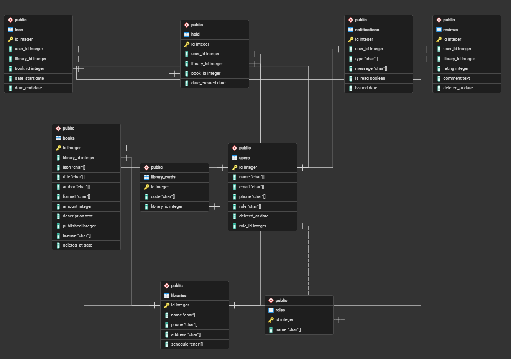

# 🔖 Liddy — Электронная библиотека

## 📦 Стек технологий

| Слой | Технологии |
|------|-----------|
| **Frontend** | React 18, TypeScript, React Router v6, Zustand, TailwindCSS, React Hook Form, Axios |
| **Backend** | Node.js, JWT |
| **Database** | PostgreSQL 15 |
| **Инфраструктура** | Docker, Docker Compose |
| **Документация** | Swagger / OpenAPI |
| **Тесты** | Jest, Supertest (backend), React Testing Library (frontend) |
| **Доп. API** | Yandex Maps API (карта библиотек) |

## 📋 Описание проекта

### Идея

Цель данного проекта состоит в создании приложения, которое превращает обычный библиотечный билет в цифровой доступ к книгам и аудиокнигам. Через него пользователь может находить, брать "на время" и читать книги из фондов своей библиотеки почти так же просто, как пользоваться стриминговым сервисом.

С технической точки зрения Liddy — это удобный интерфейс поверх библиотечной системы: он подключается к каталогу, проверяет доступность лицензий, управляет очередями и автоматически "возвращает" книги после окончания срока. В результате пользователь получает простой и современный опыт чтения, а библиотеки — инструмент для распространения цифрового контента без необходимости разрабатывать собственные приложения.

### Бизнес модель

Главная выгода — не продажа книг напрямую, а создание инфраструктуры цифровых библиотек. В данном случае **основной доход приносит продажа лицензий.** Библиотека не покупает файл, а лицензирует доступ, что заметно дороже обычной электронной книги, т.к. такая лицензий предполагает много пользователей.

Такая модель, выгодна бизнесу тем, что она превращает доступ к цифровому контенту в повторяемый B2B-доход. Вместо разовой продажи книги пользователю платформа продаёт библиотекам лицензии на временный доступ к контенту: например, "1 копия = 1 активный читатель" или лицензии с ограничением по времени и количеству выдач. Когда лицензия истекает или спрос на книгу растёт, библиотека покупает новые лицензии. В результате популярность контента автоматически генерирует дополнительные продажи, а доход становится регулярным и предсказуемым.

Для самой платформы это особенно выгодно, потому что она зарабатывает не только на контенте, но и на инфраструктуре: DRM, хранении файлов, аналитике, интеграции с библиотечными системами, очередях и мобильном приложении. При этом платформа не производит книги самостоятельно и не занимается физической логистикой, но участвует практически в каждой цифровой выдаче. Такая модель ближе к SaaS и enterprise-инфраструктуре, чем к обычному приложению для чтения.

### Целевая аудитория

- **Клиенты** — люди, которые хотят быстро и удобно брать книги, как элктронные так и физические; люди, которые хотят читать бесплатно или дешевле.
- **Библиотекари** — хотят увеличить использование фондов, хотят привлекать новую аудиторию, нуждаются в цифровых решениях.

### 🖥 Ключевые экраны и функциональность

#### Для клиента (роль: `user`)

| Экран | Что можно делать |
|-------|-----------------|
| **Главная** | Новые издания, подборки по жанрам, сезонные подборки |
| **Каталог** | Поиск, фильтрация |
| **Карточка книги** | Бронирование книги, рейтинг, комментарии |
| **Личный кабинет** | История выданных книг, редактирование профиля, смена пароля |
| **Мои книги** | Список книг со статусом, возможность отменить бронирование, читалка для электронных изданий |

#### Для библиотекаря / владельца (роль: `master`)

| Экран | Что можно делать |
|-------|-----------------|
| **Дашборд** | Сводка: какие физические книги надо будет выдать, какие должны быть возвращены |
| **Управление книгами** | Добавить/обновить/удалить книгу |
| **Управление подборками** | Добавить/обновить/удалить подборку |
| **Управление читательскими билетами** | Добавить/удалить абонемент |
| **Профиль библиотеки** | Редактирование контактов, расписания |

#### Для администратора (роль: `admin`)

| Экран | Что можно делать |
|-------|-----------------|
| **Admin-панель** | Управление пользователями, библиотеками; модерирование отзывов |

### ✨ Уникальные фичи

1. **Email-уведомления** — уведомление о доступности изданий, напоминание о сроках возврата
2. **Карта библиотек** — интеграция с Yandex Maps, геолокация пользователя
3. **Читалка для электронных изданий**

## 🗂 Сущности системы

| Сущность | Ключевые поля |
|----------|--------------|
| `User` | id, name, email, password_hash, phone, role, avatar_url |
| `Library` | id, phone, address, schedule |
| `Book` | id, library_id, isbn, title, author, annotation, year_published, format, amount, license |
| `Review` | id, user_id, library_id, rating, comment |
| `Hold` | id, user_id, book_id, library_id, date_created |
| `Loan` | id, book_id, library_id, user_id, date_start, date_end |
| `Notification` | id, user_id, type, message, is_read, sent_at |
| `Library_cards` | id, code, library_id |

## 🗃 ER-диаграмма



## 👤 User Stories

```
    Как читатель, я хочу взять книгу в один клик,
    чтобы начать читать без лишних шагов.
    Как читатель, я хочу встать в очередь на книгу, если она занята,
    и получить уведомнение о свободном издании.
    Как читатель, я хочу видеть все взятые книги в одном месте.
    Как читатель, я хочу читать книгу прямо в приложении,
    чтобы не использовать сторонние сервисы.

    Как библиотекарь, я хочу добавлять и удалять лицензии на книги,
    чтобы управлять коллекцией.
    Как библиотекарь, я хочу видеть статистику выдач и популярности,
    чтобы развивать фонд.

    Как admin, я хочу модерировать отзывы и управлять библиотеками,
    чтобы поддерживать качество платформы.
```

## 🗺 План действий

### Общая диаграмма (Gantt-стиль)

```
Неделя  │ 1  │ 2  │ 3  │ 4  │ 5  │ 6  │ 7  │ 8  │ 9  │ 10 │
────────────────────────────────────────────────────────────────
Проект. │████│████│    │    │    │    │    │    │    │    │
Фронтенд│    │░░░░│████│████│████│    │    │    │    │    │
Бэкенд  │    │    │    │████│████│████│    │    │    │    │
Интеграц│    │    │    │    │    │░░░░│████│    │    │    │
Финал   │    │    │    │    │    │    │    │████│████│████│

████ — активная разработка    ░░░░ — старт / подготовка
```

#### 1. Проектирование *(до 5 мая)*

- [x] Описание идеи и целевой аудитории
- [x] User stories для каждой роли
- [x] Список сущностей и связей
- [x] ER-диаграмма (черновик)
- [x] Список экранов

#### 2. Frontend — базовая структура *(до 14 мая)*

- [ ] Wireframes в Figma (главная, карточка мастера, форма записи)
- [ ] Структура папок фронта и бэка
- [ ] Настройка роутинга (React Router v6)
- [ ] Layout: шапка, навигация, футер
- [ ] Базовые UI-компоненты: Button, Input, Card, Modal
- [ ] Настройка Zustand (authStore)
- [ ] Страницы: Login, Register, Home (заглушки)

#### 3. Backend — ядро *(до 26 мая)*

#### 4. Frontend — основные экраны *(до 9 июня)*

#### 5. Интеграция и полировка *(до 20 июня)*

#### 6. Финализация и подготовка к защите *(до 1 июля)*
